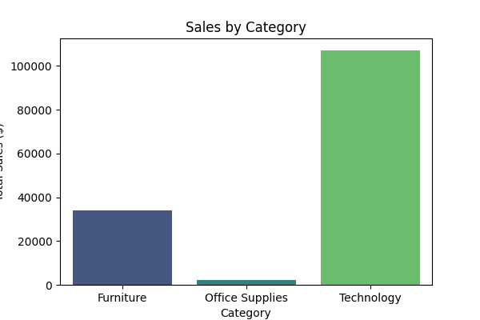
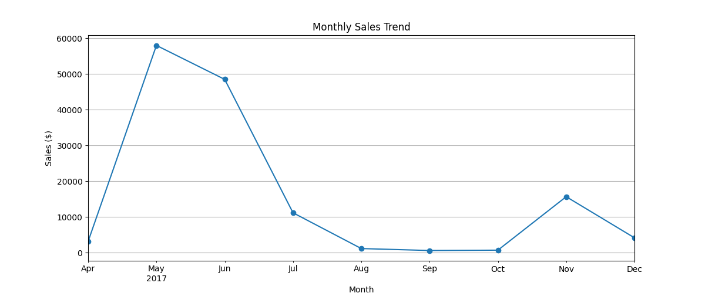
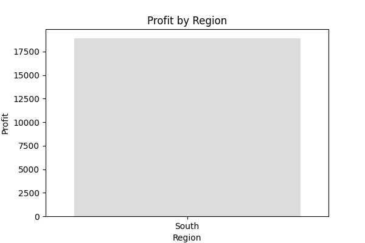
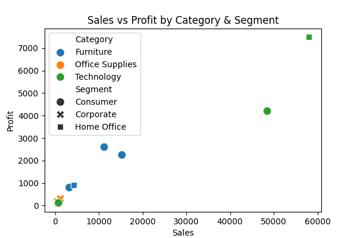

# 📊 Indian Superstore Sales Analysis

## 📌 Project Overview
This project analyzes sales, profit, and customer behavior for a **South Indian Superstore dataset**.  
The dataset contains transactions across major South Indian states: Telangana, Andhra Pradesh, Karnataka, Tamil Nadu, and Kerala.

The project demonstrates:
- Data cleaning & feature engineering
- Exploratory Data Analysis (EDA)
- Visualizations with **Python (Matplotlib & Seaborn)**
- Business insights for retail decision-making

---


---

## 🔎 Dataset Preview
| Order ID       | Order Date | Ship Date  | Customer Name | City       | State       | Category  | Sales  | Profit |
|----------------|------------|------------|---------------|------------|-------------|-----------|--------|--------|
| IN-2017-200001 | 2017-11-08 | 2017-11-11 | Ravi Kumar    | Hyderabad  | Telangana   | Furniture | 15250  | 2250   |
| IN-2017-200002 | 2017-11-08 | 2017-11-09 | Priya Sharma  | Vijayawada | Andhra Pradesh | Office Supplies | 450 | 180 |
| IN-2017-200003 | 2017-06-12 | 2017-06-16 | Arjun Reddy   | Bengaluru  | Karnataka   | Technology | 48500  | 4200  |
| IN-2017-200004 | 2017-04-15 | 2017-04-20 | Meena Iyer    | Chennai    | Tamil Nadu  | Furniture  | 3200   | 800   |
| IN-2017-200005 | 2017-09-17 | 2017-09-22 | Akhil Menon   | Kochi      | Kerala      | Office Supplies | 650 | 90 |

---

## 📈 Key Visualizations

### 1. Sales by Category


### 2. Monthly Sales Trend


### 3. Profit by Region


### 4. Sales vs Profit Scatterplot


---

## 🛠️ Tech Stack
- Python (Pandas, NumPy, Matplotlib, Seaborn)
- Google Colab / Jupyter Notebook
- GitHub for version control

---

## 📢 Business Insights
1. **Technology products** generate the highest revenue.  
2. South Indian states show strong sales in **Technology and Furniture** categories.  
3. Discounts above **10–20%** often reduce profits.  
4. **November–December** shows peak sales, suggesting seasonal demand.  
5. Some high-sales items still yield low profits due to discounts or low-margin products.

---

## 🚀 How to Run
1. Clone the repository:
```bash
git clone https://github.com/your-username/south-indian-superstore.git
cd south-indian-superstore

